  

### ▶ [**ENTER THE ARENA**](https://skyline-arena.vercel.app) &nbsp;·&nbsp; [josh-dare.vercel.app](https://josh-dare.vercel.app)

---

## 🎯 The goal

Most developer portfolios are a **list**. This one is an **experience**. You fly a drone camera into an enclosed neon night stadium, and every product I've shipped is playing **live on the jumbotrons**. The point isn't to *tell* you I can build — it's to *show* you the second the page loads.

## 🏟️ What it is

- A cinematic **drone-orbit intro** sweeps the bowl and settles onto the field.
- **7 live products** play as video on the jumbotrons — **click any screen to open the real, deployed site.**
- **Drag to spin** the arena; searchlights sweep, fireworks pop above the rim, and the crowd roars in on your first click.
- The **DARE** diamond emblem at midfield is the stamp. 💎

## 🧠 Who built it

I'm **Josh Dare** — student-athlete, **B.S. Computer Science ('26)**, and the kind of developer who'd rather hand you a **live URL than a mockup**. This is production 3D on the modern stack, deployed and running — the same bar I bring to client work across **e-commerce, AI products, dashboards, and tools**. *The athlete who ships.* 🚀

## ⚙️ What powers it

**React Three Fiber** (fiber · drei · postprocessing) · **Three.js** · **Rapier** · **Zustand** state-machine camera · **Vite + TypeScript** · **Vercel**. Real HDRI lighting + bloom, video-texture jumbotrons, a dual-rig camera engine, and graceful fallbacks (no-WebGL + reduced-motion).

## 🌆 On the jumbotrons — all live

| # | Build | What it is |
|---|-------|-----------|
| 01 | [Portfolio-OS](https://portfolio-os-navy.vercel.app) | A desktop OS in the browser — Three.js, 20 apps, zero deps |
| 02 | [D'extensionz](https://dextensionz-site.vercel.app) | Cinematic hair-brand storefront (live client) |
| 03 | [Sandy](https://chain-recall.vercel.app) | AI memory for luxury hotels — Anthropic Hackathon |
| 04 | [D'oppebraids](https://doppebraids-site-henna.vercel.app) | Booking-forward braided-hair studio site |
| 05 | [Prompt Generator](https://prompts.tdotssolutionsz.com) | Structured prompt builder for image/video AI |
| 06 | [ThrowingTracker](https://throwing-tracker.vercel.app) | Training app for throwing athletes |
| 07 | [Options Course](https://optionstradingcourse.vercel.app) | Gamified interactive options course |

---

**Josh Dare** · builder · CS '26 · [jdare354@gmail.com](mailto:jdare354@gmail.com) · [github.com/Waleee7](https://github.com/Waleee7)

*Built to ship.*

