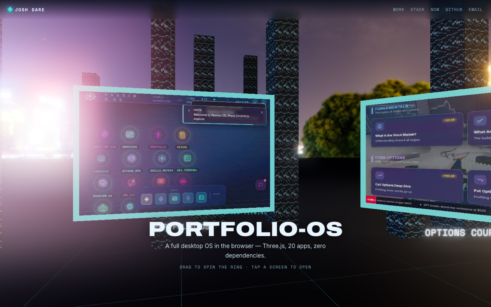
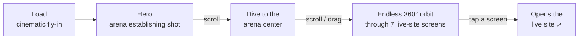
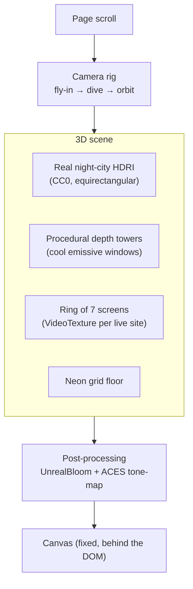

<div align="center">



# 🌃 Skyline Arena

**A cinematic WebGL portfolio you fly *through*.**
The sites, apps, and experiments I've built — on live-video screens floating in a neon-Tokyo night. Scroll into the arena, spin the ring, tap a screen to open the real thing.

[](https://skyline-arena.vercel.app)
&nbsp;


### ▶ [**Open the live experience →**](https://skyline-arena.vercel.app)

</div>

---

## What it is

A single-page portfolio that doubles as a **3D experience**. Instead of a grid of screenshots, my work lives on a ring of screens inside a photoreal neon city. Each screen **plays a real recording of the live site**, and clicking it opens that site in a new tab. It's the pitch and the proof in one: *this is the kind of thing I build.*

Built to run smooth, degrade gracefully (a full 2D fallback for no-WebGL / reduced-motion / SEO), and deploy with zero build step.

## The journey



## How it's built



- **Real city, not AI boxes** — a real photographed 360° night skyline (CC0 HDRI) is the environment; sparse procedural towers add foreground depth, fog-blended into the horizon.
- **Live-video screens** — each of the 7 builds is a short screen-recording (top→bottom scroll + a couple of clicks) mapped onto a screen; only the screen nearest the camera plays, to stay fast.
- **Scroll-driven camera** — page scroll flies you in, dives to the exact center, then spins the ring endlessly. Drag to spin manually; tap/click a screen to open its live URL.
- **Performance & a11y** — capped DPR, paused render when off-screen, `prefers-reduced-motion` respected, keyboard-navigable links, and a complete 2D DOM version if WebGL is unavailable.

## Tech

`Three.js r160` · `UnrealBloomPass` / `RGBELoader` · `VideoTexture` · vanilla JS + CSS (no framework, no build) · `Archivo` / `Space Mono` / `Inter` · deployed on `Vercel`.

## Run it locally

```bash
# any static server works — it's just index.html + main.js + style.css + assets/
python3 -m http.server 8000
# open http://localhost:8000
```

## Deploy

```bash
npx vercel deploy --prod
```

## The work on the wall

| # | Build | What it is |
|---|-------|-----------|
| 01 | [Portfolio-OS](https://portfolio-os-navy.vercel.app) | A desktop OS in the browser — Three.js, 20 apps, zero deps |
| 02 | [D'extensionz](https://dextensionz-site.vercel.app) | Cinematic hair-brand storefront (live client) |
| 03 | [Sandy](https://chain-recall.vercel.app) | AI memory for luxury hotels — Anthropic Hackathon |
| 04 | [D'oppebraids](https://doppebraids-site-henna.vercel.app) | Booking-forward braided-hair studio site |
| 05 | [Prompt Generator](https://prompts.tdotssolutionsz.com) | Structured prompt builder for image/video AI |
| 06 | [ThrowingTracker](https://throwing-tracker.vercel.app) | Training app for throwers |
| 07 | [Options Course](https://optionstradingcourse.vercel.app) | Gamified interactive options course |

## Credits

Night-city HDRI from [Poly Haven](https://polyhaven.com/) (CC0). Type: Archivo, Space Mono, Inter (Google Fonts).

---

<div align="center">

**Josh Dare** — builder · CS '26 · *the athlete who ships*
[jdare354@gmail.com](mailto:jdare354@gmail.com) · [github.com/Waleee7](https://github.com/Waleee7)

</div>
